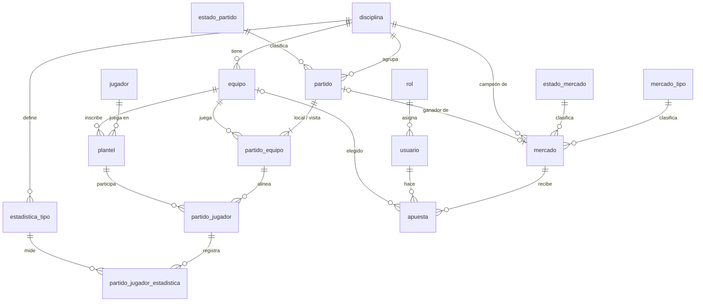

# Esquema BD — La Liga ACP

> **Documento de diseño.** Describe la base de datos planeada; todavía **no existe** ninguna tabla ni migración. Hoy la app usa datos estáticos (ver `CLAUDE.md`).

## Módulos

| Módulo | Contenido | Depende de |
|---|---|---|
| **Acceso** | Usuarios y roles. | — |
| **Informativo** | Disciplinas, equipos, jugadores, partidos, marcadores y estadísticas. | Acceso (el admin carga resultados) |
| **Polla** | Apuestas de los usuarios y los coins que ganan. | Acceso, Informativo |

Regla: **Informativo nunca depende de Polla.** La liga funciona sin la polla.

## Convenciones

- **Motor: MySQL 8** (≥ 8.0.16, para que los `CHECK` se apliquen), InnoDB, `utf8mb4`.
- Nombres en `snake_case`, en español: `estado_partido`, `equipo_id`, `es_visita`. En TypeScript se mapean a camelCase.
- `id`: `BIGINT UNSIGNED AUTO_INCREMENT` como clave primaria.
- Fechas: `DATETIME` **siempre en UTC**. MySQL no guarda la zona horaria; la conversión se hace en el backend.
- Booleanos: `BOOLEAN` (`TINYINT(1)`).
- **Vocabulario:** en el torneo se habla de **puntos** (3/1/0 en la tabla de posiciones, informativo). En la polla se habla de **coins** (lo que gana un usuario al acertar). Nunca se mezclan.
- Coins de la polla: `DECIMAL(5,1)`, porque hay valores como 1.5 y 3.5. Nunca `FLOAT`.
- Los **catálogos** (`rol`, `estado_partido`, `mercado_tipo`, `estado_mercado`) tienen un `codigo` único y estable. La lógica filtra por `codigo`, nunca por el número de `id`.
- Lo que se puede calcular **no se guarda**: tabla de posiciones, goleadores, ranking de la polla y cierre de apuestas.
- Las **reglas de coins y cierre viven en el backend**, no en tablas.

## Decisiones

| # | Decisión |
|---|---|
| D1 | Un equipo pertenece a **una sola disciplina**. |
| D2 | Un jugador puede estar en varios equipos, **pero solo uno por disciplina**. |
| D3 | **No hay temporadas.** Cada disciplina es un único torneo. |
| D4 | Un jugador **no puede cambiar de equipo** durante el torneo. |
| D5 | Local y visita se guardan en `partido_equipo`, una fila por equipo con `es_visita`. |
| D6 | El **marcador se escribe a mano**, por equipo; no se calcula de las estadísticas. |
| D7 | Las estadísticas se guardan por partido y por jugador, según la disciplina. Los totales se calculan. |
| D8 | El campeón de cada disciplina es **el primero de la tabla de posiciones** al terminar todos sus partidos. |
| D9 | Tabla de posiciones: **3 puntos por ganar, 1 por empatar, 0 por perder**. El desempate no importa. |
| D10 | La polla es **por coins**; el que más coins acumula gana el premio. Si hay empate, el premio se reparte. |
| D11 | Solo se apuesta a **qué equipo gana**: un partido (se permite el empate) o una disciplina (campeón). |
| D12 | Las apuestas a un partido cierran **24 horas antes** del partido. |
| D13 | Acertar un ganador da **3 coins**; acertar un empate da **1 coin**. Si se apostó con **48 horas o más** de anticipación: **3.5** y **1.5**. |
| D14 | El **admin carga los resultados**; el **sistema calcula** qué apuestas acertaron. |
| D15 | El admin **también puede apostar**. |

---

## Módulo Acceso

### rol — catálogo
| Campo | Tipo | Notas |
|---|---|---|
| id | PK | |
| codigo | VARCHAR, único | `apostador`, `admin` |
| nombre | VARCHAR | Etiqueta visible. |

El rol `admin` incluye los permisos de `apostador` (D15), así que basta un rol por usuario.

### usuario
| Campo | Tipo | Notas |
|---|---|---|
| id | PK | |
| rol_id | FK → rol | |
| nombre | VARCHAR | |
| email | VARCHAR, único | |

No es un jugador: son entidades distintas.

---

## Módulo Informativo

### disciplina
| Campo | Tipo | Notas |
|---|---|---|
| id | PK | |
| nombre | VARCHAR | Fútbol, Vóley… |
| slug | VARCHAR, único | |
| permite_empate | BOOLEAN | Fútbol: sí. Vóley: no. Controla si se puede apostar al empate. |

### equipo
| Campo | Tipo | Notas |
|---|---|---|
| id | PK | |
| disciplina_id | FK → disciplina | D1 |
| nombre | VARCHAR | |
| nombre_corto | VARCHAR | |
| escudo | VARCHAR | Ruta o URL del asset. |
| color_acento | VARCHAR | |

`UNIQUE(id, disciplina_id)`: permite FKs compuestas que garantizan la disciplina en otras tablas.

### jugador — la persona
| Campo | Tipo | Notas |
|---|---|---|
| id | PK | |
| nombre | VARCHAR | |
| foto | VARCHAR, opcional | |

### plantel — la persona inscrita en un equipo
| Campo | Tipo | Notas |
|---|---|---|
| id | PK | |
| jugador_id | FK → jugador | |
| equipo_id | FK → equipo | |
| disciplina_id | FK → disciplina | Copia de la del equipo, para aplicar D2. |
| numero_camiseta | SMALLINT UNSIGNED | |

- `FK(equipo_id, disciplina_id) → equipo(id, disciplina_id)`: la copia no puede contradecir al equipo.
- `UNIQUE(jugador_id, disciplina_id)`: un equipo por disciplina (D2) y sin cambios de equipo (D4).
- `UNIQUE(equipo_id, numero_camiseta)`.
- `UNIQUE(id, equipo_id)`: para la FK compuesta de `partido_jugador`.

### estado_partido — catálogo
| Campo | Tipo | Notas |
|---|---|---|
| id | PK | |
| codigo | VARCHAR, único | `programado`, `en_vivo`, `finalizado`, `suspendido` |
| nombre | VARCHAR | Etiqueta visible. |

### partido — el encuentro
| Campo | Tipo | Notas |
|---|---|---|
| id | PK | |
| disciplina_id | FK → disciplina | |
| estado_partido_id | FK → estado_partido | |
| jornada | SMALLINT UNSIGNED | |
| fecha_hora | DATETIME (UTC) | Base del cierre de apuestas y de la bonificación. |
| sede | VARCHAR | |

`UNIQUE(id, disciplina_id)`: para la FK compuesta de `partido_equipo`.

### partido_equipo — local y visita, con su marcador
| Campo | Tipo | Notas |
|---|---|---|
| id | PK | |
| partido_id | FK → partido | |
| equipo_id | FK → equipo | |
| disciplina_id | FK → disciplina | Copia, para las FKs compuestas. |
| es_visita | BOOLEAN | `false` = local, `true` = visita. |
| marcador | SMALLINT UNSIGNED, opcional | Goles o sets. Lo escribe el admin (D6). Vacío hasta que empieza. |

- `FK(partido_id, disciplina_id) → partido(id, disciplina_id)` y `FK(equipo_id, disciplina_id) → equipo(id, disciplina_id)`: el equipo es de la disciplina del partido.
- `UNIQUE(partido_id, es_visita)`: un solo local y una sola visita.
- `UNIQUE(partido_id, equipo_id)`: un equipo no juega contra sí mismo.
- `UNIQUE(id, equipo_id)`: para la FK compuesta de `partido_jugador`.
- **Backend:** cada partido debe tener exactamente 2 filas.

### partido_jugador — quién jugó
| Campo | Tipo | Notas |
|---|---|---|
| id | PK | |
| partido_equipo_id | FK → partido_equipo | El lado del partido en que jugó. |
| plantel_id | FK → plantel | |
| equipo_id | FK → equipo | Copia, para las FKs compuestas. |

- `FK(partido_equipo_id, equipo_id) → partido_equipo(id, equipo_id)` y `FK(plantel_id, equipo_id) → plantel(id, equipo_id)`: el jugador solo puede jugar para su propio equipo y en un partido donde ese equipo participa.
- `UNIQUE(partido_equipo_id, plantel_id)`.

### estadistica_tipo — catálogo por disciplina
| Campo | Tipo | Notas |
|---|---|---|
| id | PK | |
| disciplina_id | FK → disciplina | |
| codigo | VARCHAR | `goles`, `asistencias`, `faltas`, `puntos_anotados`, `aces`… |
| nombre | VARCHAR | Etiqueta visible. |

`UNIQUE(disciplina_id, codigo)`.

### partido_jugador_estadistica — los números
| Campo | Tipo | Notas |
|---|---|---|
| partido_jugador_id | FK → partido_jugador | PK compuesta |
| estadistica_tipo_id | FK → estadistica_tipo | PK compuesta |
| valor | SMALLINT UNSIGNED | |

**Backend:** la disciplina del tipo debe coincidir con la del partido.

### Calculado, no guardado
- **Tabla de posiciones:** a partir de `partido_equipo.marcador` en partidos `finalizado`, con 3/1/0 (D9).
- **Goleadores y líderes:** `SUM(valor)` por jugador y tipo de estadística.
- **Campeón:** primero de la tabla cuando todos los partidos de la disciplina están `finalizado` (D8).

---

## Módulo Polla

### mercado_tipo — catálogo
| Campo | Tipo | Notas |
|---|---|---|
| id | PK | |
| codigo | VARCHAR, único | `ganador_partido`, `campeon_disciplina` |
| nombre | VARCHAR | Etiqueta visible. |

### estado_mercado — catálogo
| Campo | Tipo | Notas |
|---|---|---|
| id | PK | |
| codigo | VARCHAR, único | `abierto`, `cerrado`, `liquidado`, `anulado` |
| nombre | VARCHAR | Etiqueta visible. |

### mercado — algo sobre lo que se apuesta
| Campo | Tipo | Notas |
|---|---|---|
| id | PK | |
| mercado_tipo_id | FK → mercado_tipo | |
| estado_mercado_id | FK → estado_mercado | |
| disciplina_id | FK → disciplina | |
| partido_id | FK → partido, opcional | Obligatorio en `ganador_partido`; vacío en `campeon_disciplina`. |

- `UNIQUE(partido_id)`: un mercado por partido. MySQL permite varios `NULL`, así que los mercados de campeón no chocan.
- **Backend:** un solo mercado `campeon_disciplina` por disciplina (MySQL no tiene índices únicos parciales), y `partido_id` obligatorio o vacío según el tipo.
- No se guarda la hora de cierre: el backend la calcula desde `partido.fecha_hora` (D12). Si el partido se reprograma, el cierre se mueve solo.

### apuesta
| Campo | Tipo | Notas |
|---|---|---|
| id | PK | |
| usuario_id | FK → usuario | |
| mercado_id | FK → mercado | |
| equipo_id | FK → equipo, opcional | El equipo elegido. **Vacío = empate**. |
| creada_en | DATETIME (UTC) | |
| actualizada_en | DATETIME (UTC) | La anticipación se mide desde aquí. |
| coins_obtenidos | DECIMAL(5,1), opcional | Vacío hasta liquidar. |

- `UNIQUE(usuario_id, mercado_id)`: **una sola elección por mercado**. Sin esto, apostar a todas las opciones asegura coins.
- **Backend:** el equipo es de la disciplina del mercado y, en `ganador_partido`, juega ese partido.
- **Backend:** empate solo en `ganador_partido` y solo si `disciplina.permite_empate`.

### Calculado, no guardado
- **Ranking de la polla:** `SUM(coins_obtenidos)` por usuario. Si hay empate, el premio se reparte (D10).

---

## Reglas del backend

**Cierre de apuestas a un partido (D12).** Se aceptan apuestas nuevas o cambios mientras `ahora < partido.fecha_hora − 24 h`.

**Coins de una apuesta a un partido (D13).** La anticipación es `partido.fecha_hora − apuesta.actualizada_en`.

| Resultado acertado | Anticipación ≥ 48 h | Anticipación entre 24 h y 48 h |
|---|---|---|
| Ganador (local o visita) | 3.5 | 3 |
| Empate | 1.5 | 1 |
| No acertó | 0 | 0 |

**Liquidar un partido.** Se dispara cuando el admin pone el partido en `finalizado`:
1. Se compara el `marcador` de las dos filas de `partido_equipo`: gana local, gana visita o empate.
2. Cada apuesta del mercado recibe `coins_obtenidos` según la tabla anterior.
3. El mercado pasa a `liquidado`.

**Liquidar el campeón.** Cuando el último partido de la disciplina queda `finalizado`, el ganador es el primero de la tabla de posiciones. Si hay empate en el primer lugar, todos los empatados cuentan como acierto.

**Corrección de un resultado.** Si el admin cambia un marcador ya liquidado, el sistema vuelve a liquidar ese mercado. Si cambia la tabla final, también el de campeón.

**Partido suspendido.** El mercado pasa a `anulado` y sus apuestas quedan en 0 coins. Si el partido se reprograma, el mercado se reabre y el cierre sigue la nueva `fecha_hora`.

**Cambiar una apuesta.** Se permite hasta el cierre. `actualizada_en` se renueva, así que quien cambia tarde pierde la bonificación.

---

## Diagrama

## Pendientes

1. **Apuesta al campeón:** ¿hasta cuándo se puede apostar y cuántos coins da acertar? Las reglas de cierre y coins de arriba solo cubren partidos. Si el cierre no se puede calcular a partir de un partido, `mercado` necesitará una columna `cierra_en`.
