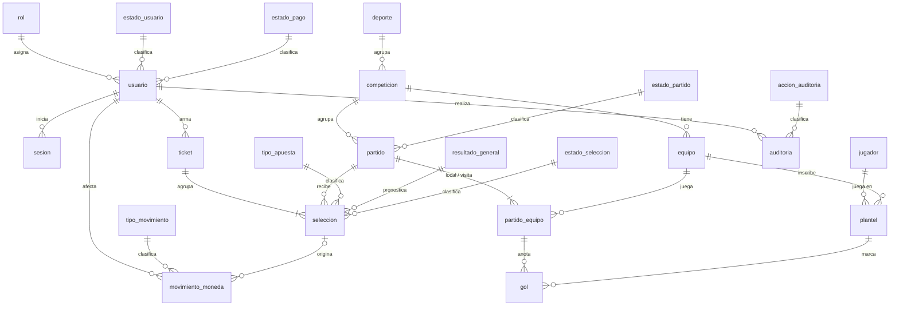

# Esquema BD — La Liga ACP

> **Documento de diseño.** Es la fuente de verdad del esquema. Manda [docs/business-rules.md](docs/business-rules.md): esta versión lo reescribe para modelar la polla deportiva (tarea T-01 de [docs/plan-polla.md](docs/plan-polla.md)). Está implementado en MySQL con Docker (`compose.yaml` y `db/init/`) y **toda la aplicación lo usa**: el backend de `server/` escribe y lee estas tablas, y desde T-22 las pantallas públicas también, a través de la API (`/public/...`). Nada queda en datos estáticos salvo las estadísticas de muestra del radar de jugador (D-022, ver `CLAUDE.md`). Si cambia este documento, `db/init/01-schema.sql` cambia en el mismo cambio.

## Módulos

| Módulo | Contenido | Depende de |
|---|---|---|
| **Acceso** | Usuarios, roles, estado de validación y de pago, sesiones. | — |
| **Informativo** | Deportes, competiciones, equipos, jugadores, partidos y goles. Es el backbone compartido: lo usa tanto la landing/fixture/posiciones como la polla. | Acceso (el admin carga resultados y goles) |
| **Polla** | Tickets, selecciones y las monedas que mueven. | Acceso, Informativo |
| **Auditoría** | Registro de operaciones administrativas relevantes (NFR-006). | Acceso (el admin que actúa); referencia libre, sin FK, a la fila afectada de cualquier módulo |

Regla: **Informativo nunca depende de Polla ni de Auditoría.** La parte informativa (deportes, fixture, tabla de posiciones) funciona sin la polla.

## Convenciones

- **Motor: MySQL 8** (≥ 8.0.16, para que los `CHECK` se apliquen), InnoDB, `utf8mb4`.
- Nombres en `snake_case`, en español: `estado_partido`, `equipo_id`, `es_visita`. En TypeScript se mapean a camelCase.
- `id`: `BIGINT UNSIGNED AUTO_INCREMENT` como clave primaria.
- Fechas: `DATETIME` **siempre en UTC**. MySQL no guarda la zona horaria; la conversión se hace en el backend. No se usa `DEFAULT CURRENT_TIMESTAMP`: el backend fija el valor explícitamente (mismo criterio que ya regía `partido.fecha_hora`).
- Booleanos: `BOOLEAN` (`TINYINT(1)`).
- **Vocabulario:** el torneo habla de **puntos** (3/1/0 en la tabla de posiciones, informativo). La polla habla de **monedas** (lo que un usuario gasta al apostar y gana al validarse) y de **puntos** también, pero son dos cosas distintas entre sí (BR-039): monedas = capacidad para apostar, puntos = rendimiento en la polla. Nunca se mezclan.
- Monedas y puntos de la polla: **enteros** (`SMALLINT UNSIGNED`/`SMALLINT`). Ya no hay `DECIMAL`: la anticipación y las bonificaciones fraccionarias del diseño anterior desaparecen.
- Los **catálogos** tienen un `codigo` único y estable. La lógica filtra por `codigo`, nunca por el número de `id`.
- Lo que se puede calcular **no se guarda**: tabla de posiciones, goleadores, resultado general del partido, ranking de la polla. La única excepción deliberada es `usuario.saldo_monedas` (ver Decisiones).
- Las **reglas de negocio críticas viven en el backend, nunca solo en el frontend** (regla general de la plataforma de apuestas).

## Decisiones

Decisiones que `business-rules.md` no fija y que se tomaron aquí. Las que dependen de que confirmes algo están marcadas **[preguntar]** y se repiten en el resumen de la tarea.

| # | Decisión |
|---|---|
| D1 | Un equipo pertenece a **una sola competición** (y por tanto a un solo deporte, vía `competicion.deporte_id`). |
| D2 | Un jugador puede estar en varios equipos, **pero solo uno por competición**. |
| D3 | **No hay temporadas.** Cada competición es un único torneo, sin edición ni año. |
| D4 | Un jugador **no puede cambiar de equipo** dentro de la misma competición. |
| D5 | Local y visita se guardan en `partido_equipo`, una fila por equipo con `es_visita`. |
| D6 | Los **goles se escriben a mano** por el admin (BR-028), por equipo, en `partido_equipo.goles`. |
| D7 | El **"Resultado" de BR-011 no es una columna**: se deriva comparando `partido_equipo.goles` de las dos filas (BR-029), igual que ya hacía el resto del esquema con lo calculable. |
| D8 | La tabla de posiciones informativa sigue siendo **3 puntos por ganar, 1 por empatar, 0 por perder** (D9 del esquema anterior). `business-rules.md` no toca esta regla: es del módulo Informativo, no de la polla. |
| D9 | **"Fecha" y "Hora" de BR-011 son un solo `fecha_hora DATETIME` en UTC**, no dos columnas. Partirlo reabriría la ambigüedad de zona horaria que el esquema ya evita en todos lados; la UI ya separa fecha y hora de un mismo valor (`formatKickoff`). |
| D10 | El **"resultado inmutable" de BR-032 no es una columna aparte**: el propio paso de `estado_partido` a `finalizado` es el momento de bloqueo. Antes de eso el admin puede editar los goles libremente; después, ni goles ni estado pueden cambiar. Se aplica en el backend (T-12), no hay trigger de base de datos. |
| D11 | El **costo de 1 moneda por selección (BR-020) no se guarda como columna**: es una constante fija de negocio, aplicada por el backend al validar el saldo (BR-021) y al descontar (BR-022). Si algún día el costo variara por tipo de apuesta, ahí sí haría falta una columna. |
| D12 | **`usuario.saldo_monedas` se guarda como columna**, además de registrar cada movimiento en `movimiento_moneda`. Es la única excepción a "lo calculable no se guarda": el saldo nunca debe ser negativo (BR-009), y MySQL no permite un `CHECK` contra una suma de otra tabla. `movimiento_moneda` es la fuente auditable; mantener la columna sincronizada con cada movimiento, en la misma transacción, es responsabilidad del backend. |
| D13 | **Los puntos NO se guardan en `usuario`.** El ranking (BR-041 a BR-044) se calcula con `SUM(seleccion.puntos_obtenidos)` agrupado por usuario, igual que la tabla de posiciones informativa. `seleccion.puntos_obtenidos` sí se guarda por fila (ver `seleccion`) porque el resultado del partido es inmutable una vez confirmado (D10): no hay reliquidación que lo invalide. |
| D14 | **`ticket` no tiene columna de "monedas utilizadas"**: se deriva contando sus selecciones (`COUNT(*)`, cada una cuesta 1 moneda fija). Como una selección anulada no se borra (solo cambia de estado), este conteo es estable en el tiempo y no se descuadra con una cancelación posterior. |
| D15 | El rol `apostador` (código sin cambios respecto del esquema anterior) es el rol "Usuario" de BR-002. Se mantiene ese código para no chocar con el nombre de la tabla `usuario`; el nombre visible sí dice "Usuario". |
| D16 | **El admin no participa en la polla** (decisión del usuario en T-04, BR-001): no se valida, no recibe monedas y no tiene selecciones ni tickets. Lo garantiza el backend (`requireBettor`, las acciones de participantes y la promoción de `admin:create`), no el esquema: una FK no puede mirar el rol. Las consultas de la polla (participantes, conteos, ranking, estadísticas) filtran `rol = apostador`. |
| D17 | **Se entra con el correo; no hay nombre de usuario aparte** (T-03). BR-003/BR-004 piden "usuario **o** correo": el correo ya es único, lo necesita el administrador para contactar al inscrito y no suma otro identificador que validar, reservar y proteger contra enumeración. `nombre` es solo para mostrar y puede repetirse. `business-rules.md` quedó alineado. |
| D18 | **Sesiones en servidor, en la tabla `sesion`** (T-03, NFR-005), no JWT. El logout tiene que invalidar de verdad: con una fila por sesión basta borrarla, mientras que un JWT seguiría siendo válido hasta vencer (o exigiría una lista de revocados, que es otra tabla igual). Se guarda el SHA-256 del token, nunca el token. |
| D19 | **La asignación de +10 es única también en la base** (T-04, BR-008). El backend valida con un `UPDATE` condicionado a `pendiente` y pago `confirmado`, dentro de la misma transacción que el movimiento. Además, `movimiento_moneda` tiene una columna generada `sin_seleccion` con `UNIQUE(usuario_id, tipo_movimiento_id, sin_seleccion)`, así que un segundo movimiento `validacion` del mismo usuario falla en la base aunque alguien lo devolviera a `pendiente` a mano. Un `CHECK` o una columna generada no pueden leer el `codigo` del catálogo; por eso la barrera es "uno por usuario y tipo entre los que no tienen selección", que hoy solo es `validacion`. Si algún día hay otro tipo sin selección que pueda repetirse (un ajuste manual, por ejemplo), hay que revisar este índice. **Límites conocidos de D19** (observados en T-04, sin cambiar el esquema todavía): (1) un movimiento `validacion` con `seleccion_id` cargado a mano esquiva la barrera, porque ahí `sin_seleccion` es NULL; (2) dos movimientos del **mismo tipo** sin selección para el mismo usuario chocan con la UNIQUE aunque sean legítimos. Por eso los débitos (T-10) y las devoluciones (T-16) siempre llevan su `seleccion_id`, y `validacion` nunca. |
| D20 | **Idempotencia del ticket con una clave del cliente** (T-10, BR-054). Al confirmar, el cliente manda un UUID nuevo en el header `Idempotency-Key`, y se guarda en `ticket.clave_idempotencia` con `UNIQUE(usuario_id, clave_idempotencia)`. Un doble clic, un reintento del navegador o un corte de conexión repiten la misma clave: si ya hay un ticket con esa clave y la misma `huella_solicitud` (SHA-256 de las selecciones), se devuelve ese ticket sin crear nada; con otras selecciones es 409 `IDEMPOTENCY_KEY_REUSED`. **La clave dura lo que dura el ticket**, es decir, para siempre: los tickets nunca se borran, y así un reintento tardío tampoco duplica. Se descartó deduplicar "por ventana de tiempo" o por contenido, porque dos tickets idénticos seguidos son legítimos (BR-017). Si la confirmación falla (selección inválida, saldo), no se guarda nada y la misma clave puede volver a usarse. |
| D21 | **El estado "en curso" se calcula, no lo escribe un proceso** (T-13, decisión del usuario en BR-012). Un partido empieza solo a su `fecha_hora` y dura 60 minutos, pero nada cambia la fila en ese momento: `estado_partido_id` puede seguir en `programado`. El backend usa siempre el **estado efectivo** (`server/src/lib/match-state.ts`): `programado` con `fecha_hora <= ahora` es `en_curso`, en respuestas, filtros y reglas, con la misma condición en SQL. Se descartó un proceso programado que actualice la columna: dependería de que corra a tiempo y dejaría ventanas en las que un partido ya empezado se trate como programado. Las acciones que tocan el partido escriben el estado que implican (cargar el resultado escribe `en_curso`; confirmarlo, `finalizado`). |

**Resueltas el 2026-09-15 (respuesta del usuario, ya reflejada en `business-rules.md`):**

- **"Empate" en `resultado_general` sí está condicionado por `deporte.permite_empate`.** BR-015 ahora lo dice explícitamente: el empate solo se ofrece en deportes que lo admiten (ni se ofrece ni se acepta en Vóley o Básquet). `deporte.permite_empate` queda confirmado en el esquema; la restricción en sí (no ofrecer/aceptar la opción cuando `permite_empate = false`) se aplica en el backend, cuando corresponda (T-09), no en el esquema de T-01.
- **BR-007 ya no pide un "Estado" suelto.** Se eliminó de `business-rules.md`: la tabla de inscritos muestra solo "Estado de pago" y "Estado de validación", exactamente los dos catálogos que ya existían (`estado_pago`, `estado_usuario`). No hace falta ninguna columna nueva.

**Abiertas (no bloquean T-01, pero conviene resolverlas antes de las tareas que las tocan):**

- **Duplicados exactos en `seleccion`** (resuelta en T-09: se permiten, cada uno cuesta su moneda y la vista previa los marca; ver BR-017 en `business-rules.md`): nada en el esquema impide que un usuario repita la misma selección exacta (mismo partido, mismo tipo, mismo pronóstico), ni dentro de un ticket ni entre tickets. `business-rules.md` no lo prohíbe (BR-017/BR-018 solo muestran pronósticos *distintos* como ejemplo) y no le puse una `UNIQUE` para no bloquear un caso que nadie pidió prohibir. Si se quiere prohibir, es una regla de backend, no de esquema.
- **Idempotencia del ticket (BR-054):** resuelta en T-10, ver D20.

---

## Módulo Acceso

### rol — catálogo
| Campo | Tipo | Notas |
|---|---|---|
| id | PK | |
| codigo | VARCHAR, único | `apostador` (rol "Usuario" de BR-002, D15), `admin` |
| nombre | VARCHAR | Etiqueta visible. |

Un rol por usuario. Los roles no se incluyen entre sí: el `admin` administra y **no apuesta** (D16).

### estado_usuario — catálogo
| Campo | Tipo | Notas |
|---|---|---|
| id | PK | |
| codigo | VARCHAR, único | `pendiente`, `validado` (BR-005) |
| nombre | VARCHAR | Etiqueta visible. |

### estado_pago — catálogo
| Campo | Tipo | Notas |
|---|---|---|
| id | PK | |
| codigo | VARCHAR, único | `pendiente`, `confirmado` (BR-006) |
| nombre | VARCHAR | Etiqueta visible. |

### usuario
| Campo | Tipo | Notas |
|---|---|---|
| id | PK | Identificador único (BR-003). |
| rol_id | FK → rol | |
| estado_usuario_id | FK → estado_usuario | BR-005. |
| estado_pago_id | FK → estado_pago | BR-006/BR-007. |
| nombre | VARCHAR | Nombre a mostrar (no lo pide BR-003, pero hace falta para "Participante" en el ranking, BR-042, y "Usuario" en la tabla de inscritos, BR-007). |
| email | VARCHAR, único | Es el "usuario o correo electrónico" de BR-003: se usa solo el correo, sin una columna de nombre de usuario aparte (D17). El backend lo guarda recortado y en minúsculas; la collation `_ci` hace que la unicidad tampoco distinga mayúsculas. |
| password_hash | VARCHAR(255) | Nunca texto plano (BR-004). argon2id en formato PHC (`$argon2id$v=19$m=...`), calculado por el backend (T-03). |
| saldo_monedas | SMALLINT UNSIGNED | Ver decisión D12. `DEFAULT 0`. Sin `CHECK` aparte: `UNSIGNED` ya impide un valor negativo por el tipo (a diferencia del viejo `coins_obtenidos`, un `DECIMAL` con signo, que sí necesitaba uno). |
| creado_en | DATETIME (UTC) | Fecha de inscripción (BR-007). |

No es un jugador: son entidades distintas.

El registro por la API siempre crea `apostador`, `pendiente`, pago `pendiente` y saldo 0 (las 10 monedas llegan al validar, BR-008). Un `admin` solo se crea o promueve con el comando del backend (ver `server/README.md`), y solo se promueve una cuenta que nunca participó (pendiente, sin pago, sin monedas, sin movimientos ni tickets).

### sesion
Una sesión iniciada (NFR-005, D18).

| Campo | Tipo | Notas |
|---|---|---|
| id | PK | |
| usuario_id | FK → usuario | `ON DELETE CASCADE`: una sesión no tiene sentido sin su usuario. |
| token_hash | CHAR(64) ASCII, único | SHA-256 en hex del token aleatorio de la cookie. El token nunca se guarda: una copia de la base no permite entrar. |
| creado_en | DATETIME (UTC) | |
| expira_en | DATETIME (UTC), índice | Vencimiento absoluto (`SESSION_TTL_HOURS`). `CHECK (expira_en > creado_en)`. Índice `idx_sesion_expira_en` para la purga. |

- **Backend:** una sesión vale solo si `expira_en > ahora`. Logout borra la fila. Cada inicio de sesión purga las sesiones vencidas de **todos** los usuarios (hasta 500 por vez, usando el índice) y borra la que traía la cookie, si había una.

---

## Módulo Informativo

### deporte
| Campo | Tipo | Notas |
|---|---|---|
| id | PK | |
| nombre | VARCHAR | Fútbol, Vóley… (BR-001, BR-048). |
| slug | VARCHAR, único | Para filtrar/enrutar por deporte. |
| permite_empate | BOOLEAN | Condiciona si `resultado_general` ofrece "Empate" para partidos de este deporte (BR-015). **Backend (T-06):** solo cambia si ningún partido del deporte salió de `programado` y no hay selecciones sobre sus partidos. |

### competicion — "Competición o torneo" de BR-011
| Campo | Tipo | Notas |
|---|---|---|
| id | PK | |
| deporte_id | FK → deporte | |
| nombre | VARCHAR | |
| slug | VARCHAR | Único por deporte, no global (dos deportes pueden compartir slug). |

`UNIQUE(id, deporte_id)`: para FKs compuestas si algún día hiciera falta bajar `deporte_id` a otra tabla (hoy no hace falta: `equipo`/`partido` se enganchan por `competicion_id`, que ya fija el deporte).

### equipo
| Campo | Tipo | Notas |
|---|---|---|
| id | PK | |
| competicion_id | FK → competicion | D1. |
| nombre | VARCHAR | |
| nombre_corto | VARCHAR | No lo pide ninguna BR; se mantiene por continuidad con la landing informativa. |
| escudo | VARCHAR | Ruta o URL del asset. Ídem. **Backend (T-06):** una URL `https://` o una ruta relativa a una imagen (`escudos/boca.webp`), hasta 255 caracteres; sin subida de archivos hasta T-13. |
| color_acento | VARCHAR | Ídem. **Backend (T-06):** `#rrggbb`, guardado en minúsculas. |

`UNIQUE(id, competicion_id)`: permite FKs compuestas que garantizan la competición en otras tablas.

### jugador — la persona
| Campo | Tipo | Notas |
|---|---|---|
| id | PK | |
| nombre | VARCHAR | |
| foto | VARCHAR, opcional | **Backend (T-06):** mismo formato que `equipo.escudo`. |

### plantel — la persona inscrita en un equipo
| Campo | Tipo | Notas |
|---|---|---|
| id | PK | |
| jugador_id | FK → jugador | |
| equipo_id | FK → equipo | |
| competicion_id | FK → competicion | Copia de la del equipo, para aplicar D2. |
| numero_camiseta | SMALLINT UNSIGNED | No lo pide ninguna BR; se mantiene por continuidad con la plantilla informativa. **Backend (T-06):** de 1 a 99. |

- `FK(equipo_id, competicion_id) → equipo(id, competicion_id)`: la copia no puede contradecir al equipo.
- `UNIQUE(jugador_id, competicion_id)`: un equipo por competición (D2) y sin cambios de equipo (D4).
- `UNIQUE(equipo_id, numero_camiseta)`.
- `UNIQUE(id, equipo_id)`: para la FK compuesta de `gol`.
- **Backend (T-06):** `competicion_id` sale siempre del equipo; el cliente no lo elige, y si lo manda debe coincidir. Una inscripción solo cambia su número de camiseta (D4: sin transferencias).

**Borrado (T-06).** No hay borrado en cascada ni borrado lógico: el catálogo solo se corrige mientras nada lo usa. El backend rechaza borrar (409, con las cantidades) un deporte con competiciones; una competición con equipos, partidos o jugadores inscritos; un equipo con partidos, jugadores inscritos o goles; un jugador inscrito; o una inscripción con goles. Mover un equipo de competición o una competición de deporte sigue la misma idea: solo mientras nada los ata al lugar actual.

### estado_partido — catálogo
| Campo | Tipo | Notas |
|---|---|---|
| id | PK | |
| codigo | VARCHAR, único | `programado`, `en_curso`, `finalizado`, `cancelado` (BR-012) |
| nombre | VARCHAR | Etiqueta visible. |

### partido — el encuentro
| Campo | Tipo | Notas |
|---|---|---|
| id | PK | |
| competicion_id | FK → competicion | BR-011 ("Deporte" se obtiene por `JOIN` a través de `competicion`, sin duplicar la columna). |
| estado_partido_id | FK → estado_partido | |
| jornada | SMALLINT UNSIGNED | No lo pide ninguna BR; se mantiene por continuidad con el fixture agrupado por jornada. |
| fecha_hora | DATETIME (UTC) | D9. Base del cierre de apuestas (BR-014). |
| sede | VARCHAR | No lo pide ninguna BR; se mantiene por continuidad. |

`UNIQUE(id, competicion_id)`: para la FK compuesta de `partido_equipo`.

Índice `idx_partido_fecha_hora (fecha_hora)` (T-07): los filtros por rango de fechas y el orden por proximidad (BR-013) de todas las vistas de partidos.

Índice `idx_partido_jornada (jornada)` (T-08): el fixture público filtrado solo por jornada (`GET /public/partidos?jornada=`). Sin él, MySQL recorría todos los partidos; con 20 competiciones y 3800 partidos lee unos 100. El filtro por deporte no necesita índice propio: pasa por `uq_competicion_deporte_slug` y `fk_partido_competicion` (un `deporte_id` en `partido` duplicaría el dato, ver la regla de arriba).

**Backend (T-07):**

- Alta siempre en `programado`, con sus dos `partido_equipo` en la misma transacción.
- Transiciones (T-13): `en_curso` llega solo a la `fecha_hora` (estado efectivo, D21); no hay cambios de estado manuales. `finalizado` solo en T-12 (pasados los 60 minutos) y `cancelado` solo en T-16.
- Un partido que ya empezó no se posterga, no cambia de equipos y no se borra.
- `finalizado` y `cancelado` bloquean la fila.
- Cambiar la competición o los equipos borra y recrea las dos filas de `partido_equipo`, porque su FK compuesta apunta a `(partido.id, competicion_id)`. Solo se permite sin apuestas ni goles.

### partido_equipo — local y visita, con sus goles
| Campo | Tipo | Notas |
|---|---|---|
| id | PK | |
| partido_id | FK → partido | |
| equipo_id | FK → equipo | |
| competicion_id | FK → competicion | Copia, para las FKs compuestas. |
| es_visita | BOOLEAN | `false` = local, `true` = visita. |
| goles | SMALLINT UNSIGNED, opcional | Lo escribe el admin (D6, BR-028). Vacío hasta que se registra el resultado. |

- `FK(partido_id, competicion_id) → partido(id, competicion_id)` y `FK(equipo_id, competicion_id) → equipo(id, competicion_id)`: el equipo es de la competición del partido.
- `UNIQUE(partido_id, es_visita)`: un solo local y una sola visita.
- `UNIQUE(partido_id, equipo_id)`: un equipo no juega contra sí mismo.
- `UNIQUE(id, equipo_id)`: para la FK compuesta de `gol`.
- **Backend:** cada partido debe tener exactamente 2 filas. Una vez `partido.estado_partido = finalizado`, `goles` queda bloqueado (D10).
- **Backend (T-12):** `goles` se carga y corrige con los dos lados juntos (0 a 999), solo con el partido `en_curso` o `programado` con la fecha ya pasada (que pasa a `en_curso`). Se confirma con los dos lados cargados, y la confirmación es el paso a `finalizado` (D10). Mientras no se confirme, el marcador no se muestra ni cuenta. El resultado general (BR-029) se calcula en `server/src/lib/match-result.ts` y nunca se guarda.

### gol — autor de un gol (BR-033)
| Campo | Tipo | Notas |
|---|---|---|
| id | PK | |
| partido_equipo_id | FK → partido_equipo | El lado del partido que anotó. |
| plantel_id | FK → plantel | Quién anotó. |
| equipo_id | FK → equipo | Copia, para las FKs compuestas. |
| minuto | SMALLINT UNSIGNED | De 1 a 120 (`CHECK`, T-13): el partido dura 60 minutos y queda margen para descuentos y tiempos extra. |
| imagen | CHAR(37) ascii, opcional | BR-033 (T-13): nombre del archivo subido y reprocesado por el backend (32 hex + `.webp`), guardado en `UPLOADS_DIR`. Nunca una URL ni un nombre del cliente. `UNIQUE` y `CHECK` de forma. |
| video | VARCHAR(255), opcional | BR-033 (T-13): enlace `https` normalizado a YouTube o Vimeo (`server/src/lib/video-links.ts`). El servidor nunca lo descarga. |

- `FK(partido_equipo_id, equipo_id) → partido_equipo(id, equipo_id)` y `FK(plantel_id, equipo_id) → plantel(id, equipo_id)`: el jugador solo puede anotar para su propio equipo y en un partido donde ese equipo participa.
- **Backend (T-13):** los goles se registran, editan y borran solo desde que el partido empieza y hasta que se confirma su resultado. El jugador tiene que estar inscrito en ese equipo en esa competición. Los goles atribuidos a un lado nunca superan los cargados en `partido_equipo.goles`. La imagen y el video se pueden agregar o quitar también después de confirmar: no cambian el resultado.
- Reemplaza a las viejas `partido_jugador`, `estadistica_tipo` y `partido_jugador_estadistica`: ninguna BR pide un sistema genérico de estadísticas por disciplina, y las estadísticas del radar de jugador del frontend (`PlayerStats`) son datos aleatorios de `src/data/`, sin relación con estas tablas (ver `CLAUDE.md`).

### multimedia_partido — imágenes y videos del partido (T-13, BR-001, BR-033)
| Campo | Tipo | Notas |
|---|---|---|
| id | PK | |
| partido_id | FK → partido | |
| imagen | CHAR(37) ascii, opcional | Archivo subido, igual que `gol.imagen`. |
| video | VARCHAR(255), opcional | Enlace normalizado, igual que `gol.video`. |
| creado_en | DATETIME (UTC) | |

- `CHECK`: cada fila es una imagen **o** un video, nunca ambos ni ninguno. `UNIQUE(imagen)`: un archivo pertenece a una sola fila.
- Índice `idx_multimedia_partido (partido_id, id)`: la multimedia de un partido en orden; también sirve a la FK.
- No cambia el resultado ni los puntos: se agrega o quita desde que el partido empieza, también después de confirmarlo. En un partido cancelado, no. El backend limita la cantidad por partido (20 imágenes y 10 videos).
- Público solo con el partido finalizado y el marcador completo, como los goles (BR-049).

### Calculado, no guardado
- **Tabla de posiciones:** a partir de `partido_equipo.goles` en partidos `finalizado`, con 3/1/0 (D8). **Backend (T-08):** `GET /public/competiciones/:id/posiciones`; orden y columnas en BR-050. Usa `fk_equipo_competicion`, el índice por equipo de `partido_equipo` y `uq_partido_equipo_lado` (revisado con `EXPLAIN`).
- **Goleadores:** `COUNT(*)` de `gol` por jugador.
- **Resultado general de un partido:** comparando los `goles` de sus dos filas de `partido_equipo` (D7, BR-029).

---

## Módulo Polla

### tipo_apuesta — catálogo
| Campo | Tipo | Notas |
|---|---|---|
| id | PK | |
| codigo | VARCHAR, único | `resultado_general` (BR-015), `marcador_exacto` (BR-016) |
| nombre | VARCHAR | Etiqueta visible. |

### resultado_general — catálogo
| Campo | Tipo | Notas |
|---|---|---|
| id | PK | |
| codigo | VARCHAR, único | `local_gana`, `empate`, `visitante_gana` (BR-029) |
| nombre | VARCHAR | Etiqueta visible. |

Se usa dos veces: como pronóstico de una `seleccion` de tipo `resultado_general`, y como resultado derivado de un partido (nunca guardado, D7).

### estado_seleccion — catálogo
| Campo | Tipo | Notas |
|---|---|---|
| id | PK | |
| codigo | VARCHAR, único | `pendiente`, `acertada`, `no_acertada`, `anulada` (BR-027) |
| nombre | VARCHAR | Etiqueta visible. |

### ticket
| Campo | Tipo | Notas |
|---|---|---|
| id | PK | Identificador único (BR-025). |
| usuario_id | FK → usuario | |
| creado_en | DATETIME (UTC) | Fecha y hora del ticket (BR-025). |
| clave_idempotencia | CHAR(36) ascii | UUID en minúsculas que el cliente manda en el header `Idempotency-Key` al confirmar (BR-054, D20). |
| huella_solicitud | CHAR(64) ascii | SHA-256 (hex) de las selecciones pedidas, en orden. Distingue un reintento de otra solicitud con la misma clave (D20). |

- `UNIQUE(usuario_id, clave_idempotencia)`: un usuario no puede tener dos tickets con la misma clave. También sirve de índice para la FK a `usuario`.
- Índice `idx_ticket_usuario_fecha (usuario_id, creado_en, id)` (T-11): los tickets de un usuario en el orden de "Mis apuestas", del más reciente al más antiguo.
- `CHECK`: la clave tiene forma de UUID en minúsculas y la huella son 64 dígitos hexadecimales.

- Sus selecciones, partidos, pronósticos y tipos de apuesta se leen por `JOIN` a `seleccion`. Monedas usadas y puntos obtenidos son calculados (D14, D13); el ticket no tiene un catálogo de estados propio (`business-rules.md` solo define estados para `seleccion`, BR-027), así que su "estado" se muestra derivado de sus selecciones. Regla (T-10, BR-025): `pendiente` si alguna selección está pendiente; si no, `anulado` si todas están anuladas, y `finalizado` en otro caso. Toda selección nace `pendiente` con `puntos_obtenidos` NULL.

### seleccion — una apuesta individual dentro de un ticket
| Campo | Tipo | Notas |
|---|---|---|
| id | PK | |
| ticket_id | FK → ticket | |
| partido_id | FK → partido | |
| tipo_apuesta_id | FK → tipo_apuesta | |
| pronostico_resultado_id | FK → resultado_general, opcional | Se usa si `tipo_apuesta = resultado_general`. |
| pronostico_goles_local | SMALLINT UNSIGNED, opcional | Se usa si `tipo_apuesta = marcador_exacto`. |
| pronostico_goles_visitante | SMALLINT UNSIGNED, opcional | Ídem. |
| estado_seleccion_id | FK → estado_seleccion | BR-027. |
| puntos_obtenidos | SMALLINT UNSIGNED, opcional | Vacío hasta liquidar. Ver D13. |

- `CHECK`: exactamente una de las dos formas de pronóstico tiene valor (igual patrón que la vieja `ck_mercado_objetivo`, sin depender de otra tabla).
- **Backend:** que la forma usada corresponda al `tipo_apuesta` (por `codigo`), que el partido esté `programado` y dentro del plazo (BR-014, `fecha_hora − 24h`), y que el costo de 1 moneda (D11) no supere el saldo (BR-021).
- `CHECK (puntos_obtenidos IN (0, 1, 3))`: son los únicos valores que produce la tabla de puntuación (BR-035 a BR-038).
- Índice `idx_seleccion_ticket_estado (ticket_id, estado_seleccion_id, puntos_obtenidos)` (T-11): calcula el estado, las monedas y los puntos de cada ticket leyendo solo el índice. También es el índice de la FK a `ticket`, que antes tenía uno propio. Con 1000 tickets y 3000 selecciones de un usuario, la página de "Mis apuestas" pasó de unos 28 ms a 16 ms, y el resumen de 21 ms a 12 ms.
- Índice `idx_seleccion_partido_estado (partido_id, estado_seleccion_id)` (T-14): las selecciones pendientes de un partido, que se liquidan al confirmar su resultado y que cuenta su vista previa. También es el índice de la FK a `partido`, que antes tenía uno propio (`fk_seleccion_partido`). Con 5000 selecciones pendientes en un partido, la liquidación hace 8 sentencias.
- **Backend (T-14):** al confirmar el resultado, cada selección `pendiente` del partido pasa a `acertada` (con 3 o 1 puntos) o `no_acertada` (con 0), según la tabla de "Reglas del backend". Las `anulada` y las ya liquidadas no cambian, y ningún punto genera un movimiento de monedas (BR-039).
- Varias selecciones por partido y por ticket, incluso contradictorias entre sí, están permitidas (BR-017, BR-018): no hay `UNIQUE` que las junte por `usuario_id`/`partido_id` como en el diseño anterior.

### tipo_movimiento — catálogo
| Campo | Tipo | Notas |
|---|---|---|
| id | PK | |
| codigo | VARCHAR, único | `validacion` (BR-008, +10), `seleccion_confirmada` (BR-020, −1), `devolucion_cancelacion` (BR-046, +1) |
| nombre | VARCHAR | Etiqueta visible. |

Solo los tres eventos de la tabla 28 que efectivamente mueven monedas; "apuesta incorrecta" y "apuesta acertada" no generan movimiento (la tabla lo dice explícitamente: "sin devolución").

### movimiento_moneda
| Campo | Tipo | Notas |
|---|---|---|
| id | PK | |
| usuario_id | FK → usuario | |
| tipo_movimiento_id | FK → tipo_movimiento | |
| seleccion_id | FK → seleccion, opcional | Vacío en `validacion`; presente en `seleccion_confirmada` y `devolucion_cancelacion`. |
| cantidad | SMALLINT | Con signo: positivo para créditos, negativo para débitos. |
| creado_en | DATETIME (UTC) | |
| sin_seleccion | TINYINT, generada (`STORED`) | `1` si `seleccion_id` es NULL, NULL si no. Nadie la escribe; existe solo para el índice de abajo (D19). |

- `UNIQUE(seleccion_id, tipo_movimiento_id)`: una selección no puede procesarse dos veces con el mismo tipo de movimiento (protege contra reintentos duplicados, en el espíritu de BR-054). No aplica a `validacion` (MySQL no cruza varios `NULL` en un índice único).
- `UNIQUE(usuario_id, tipo_movimiento_id, sin_seleccion)`: como mucho **un** movimiento sin selección por usuario y tipo. Es la barrera de base de datos de BR-008: un usuario no puede recibir dos veces el `validacion` de +10 aunque el backend fallara (D19). A los tipos que siempre llevan selección no los afecta, porque ahí `sin_seleccion` es NULL y MySQL no compara NULL en un índice único.
  - **Límites conocidos de D19** (observados en T-04, sin cambiar el esquema todavía): (1) un movimiento `validacion` con `seleccion_id` cargado a mano esquiva la barrera, porque ahí `sin_seleccion` es NULL; (2) dos movimientos del **mismo tipo** sin selección para el mismo usuario chocan con la UNIQUE aunque sean legítimos. La regla del backend: `seleccion_confirmada` y `devolucion_cancelacion` siempre llevan `seleccion_id`, y `validacion` nunca (ver notas de T-10 y T-16 en `docs/plan-polla.md`).
- `CHECK (cantidad <> 0)`.
- Índice `idx_movimiento_usuario_fecha (usuario_id, creado_en, id)` (T-05): el historial propio, del más reciente al más antiguo, y la suma por usuario de la comprobación de consistencia.
- **Backend:** mantener `usuario.saldo_monedas` sincronizado con la suma de sus movimientos, en la misma transacción que cada inserción (D12, BR-053, BR-055). Desde T-05 hay un único punto que escribe ambos: `server/src/services/coins.service.ts`. Bloquea la fila del usuario, no deja el saldo negativo, inserta los movimientos y fija el saldo nuevo. `npm run coins:check` compara cada saldo con `SUM(cantidad)` y lista los descuadres sin corregirlos.

---

## Módulo Auditoría

### accion_auditoria — catálogo
| Campo | Tipo | Notas |
|---|---|---|
| id | PK | |
| codigo | VARCHAR, único | Las 5 de NFR-006: `validacion_usuario`, `modificacion_partido`, `registro_resultado`, `confirmacion_resultado`, `cancelacion_partido`. Desde T-17, además: `confirmacion_pago`, `reversion_pago`, `creacion_administrador` y `promocion_administrador` (el comando `admin:create`, D-005), `alta_partido`, `borrado_partido`, y `alta_*`, `modificacion_*` y `borrado_*` de `deporte`, `competicion`, `equipo`, `jugador`, `plantel` y `gol`, más `alta_multimedia` y `borrado_multimedia`. |
| nombre | VARCHAR | Etiqueta visible. |
| entidad | VARCHAR | Qué tabla afecta esta acción (`usuario`, `partido`, `deporte`, `competicion`, `equipo`, `jugador`, `plantel`, `gol` o `multimedia_partido`), siempre la misma por código. |

El backend mapea cada acción de la aplicación a su código en un solo lugar (`server/src/lib/audit.ts`), y una prueba verifica que el catálogo y ese mapa coincidan.

### auditoria
| Campo | Tipo | Notas |
|---|---|---|
| id | PK | |
| usuario_id | FK → usuario | El administrador que actuó. |
| accion_id | FK → accion_auditoria | |
| entidad_id | BIGINT UNSIGNED | El id de la fila afectada. **Sin FK**: apunta a tablas distintas según `accion_id`, y MySQL no admite una FK condicional. Integridad a cargo del backend. |
| creado_en | DATETIME (UTC) | Fecha y hora de la acción. |
| detalle | JSON, opcional | T-17: un objeto breve (de hasta 8 niveles, con textos cortados sin partir caracteres) con lo que pasó (campos cambiados con su valor anterior y nuevo, lo creado o borrado, el marcador, las cifras de una cancelación). `CHECK`: objeto JSON de hasta 4 KB (`JSON_STORAGE_SIZE`). Nunca contraseñas, hashes, tokens, claves, correos ni saldos: lo filtra el backend. |

- Índices (T-17): `idx_auditoria_fecha (creado_en, id)` para la consulta del admin (la más reciente primero); `idx_auditoria_accion_entidad (accion_id, entidad_id, creado_en)` para filtrar por acción y registro afectado (también es el de la FK a `accion_auditoria`); `idx_auditoria_usuario_fecha (usuario_id, creado_en)` para filtrar por administrador (también es el de la FK a `usuario`).
- **Backend (T-17):** la fila se inserta en la misma transacción que la acción (el gancho `hooks.inTransaction`), así que una acción rechazada no deja registro y un fallo al registrar deshace la acción. Antes de insertar verifica que el autor sea admin, que el código exista con la entidad esperada y que la fila afectada exista (salvo en los borrados). Nadie actualiza ni borra filas de `auditoria`, y borrar la fila afectada no las borra (`entidad_id` no tiene FK). Una edición que no cambia nada no deja fila (D-004). En las filas de `admin:create` el autor es la propia cuenta creada o promovida (D-005).

---

## Reglas del backend

**Cierre de apuestas a un partido (BR-014).** Se aceptan selecciones nuevas mientras `ahora < partido.fecha_hora − 24h` y `partido.estado_partido = programado` (BR-012).

**Puntos de una selección (BR-035 a BR-038), evaluados por separado al confirmar el resultado:**

| Tipo de apuesta | Condición | Puntos |
|---|---|---|
| `resultado_general` | Acierta el ganador | +3 |
| `resultado_general` | Acierta el empate | +1 |
| `marcador_exacto` | Acierta ambos goles | +3 |
| Cualquiera | No acierta | 0 |

**Liquidar un partido.** Se dispara cuando el admin confirma el resultado y el partido pasa a `finalizado` (D10):
1. Se compara `goles` de las dos filas de `partido_equipo`: gana local, gana visita o empate (D7).
2. Cada `seleccion` **pendiente** de ese `partido_id` se evalúa según la tabla de arriba y pasa a `acertada` o `no_acertada`, con sus `puntos_obtenidos`, en la misma transacción que la confirmación (T-14, `server/src/services/bets-settlement.service.ts`; los puntos están en `server/src/lib/points.ts`).
3. Los goles y el estado del partido quedan bloqueados; nada de esto se puede deshacer desde la aplicación (BR-031, BR-032).

**Partido cancelado (BR-045 a BR-047).** El `estado_partido` pasa a `cancelado`:
1. Cada `seleccion` **pendiente** de ese `partido_id` pasa a `anulada`, con `puntos_obtenidos` NULL (sin importar el ticket al que pertenezca). Las ya liquidadas o anuladas (solo posibles con datos cargados a mano) no cambian.
2. Por cada una que tenga su débito (`seleccion_confirmada`), se crea un `movimiento_moneda` de tipo `devolucion_cancelacion` con `cantidad = +1` y su `seleccion_id` (D19), y se actualiza `usuario.saldo_monedas` en la misma transacción (BR-055). Una sin débito, o de una cuenta que hoy es admin (D-002 de `docs/decisiones.md`), se anula sin devolución.
3. Las demás selecciones del mismo ticket, de otros partidos, no se tocan (BR-047).
4. **Backend (T-16):** `server/src/services/match-cancellation.service.ts`, en `READ COMMITTED`. Bloquea primero los usuarios afectados y después el partido (orden usuario → partido), y empieza de nuevo si mientras tanto apostó un usuario que no había bloqueado. La cancelación es definitiva: `cancelado` bloquea la fila igual que `finalizado`. Un partido cancelado solo se borra si no tiene apuestas, goles, resultado ni multimedia (D-001). El marcador, los goles y la multimedia que tuviera se conservan, pero no son públicos.

**Validar un usuario (BR-006 a BR-008).** El admin pone `estado_usuario = validado`:
1. Se crea un `movimiento_moneda` de tipo `validacion` con `cantidad = +10`, y se actualiza `usuario.saldo_monedas`.
2. Solo debe ocurrir una vez por usuario: el backend lo garantiza validando que el usuario esté hoy en `pendiente` antes de aplicar el cambio (no hay forma de expresar "una sola vez" con una restricción de la tabla, porque no depende del contenido de la fila sino de su transición).

**Ranking de la polla (BR-041 a BR-044).** `SUM(seleccion.puntos_obtenidos)` por usuario, orden `puntos DESC, aciertos DESC` (aciertos = `COUNT(seleccion.estado_seleccion = acertada)`). Empate total: comparten posición (BR-043 lo deja abierto).

**Auditoría (NFR-006, T-17).** Cada acción de `accion_auditoria` inserta una fila en `auditoria` con el admin, la acción, el id de la fila afectada y su detalle, como parte de la misma operación.

---

## Herramienta de desarrollo: `dato_demo` (D-016)

**No es parte del esquema de la aplicación**: no está en `db/init/` ni en el diagrama, y ningún código de la aplicación la lee ni la escribe. La crea el comando de datos de ejemplo (`server:seed:dev`, ver `server/README.md`), solo en la base de desarrollo, para anotar cada fila que carga.

| Campo | Tipo | Notas |
|---|---|---|
| tabla | VARCHAR(50) | `deporte`, `competicion`, `equipo`, `jugador`, `plantel`, `partido`, `partido_equipo` o `usuario`. |
| fila_id | BIGINT UNSIGNED | El id de la fila creada. |

- `PRIMARY KEY (tabla, fila_id)`. Sin FK: las filas marcadas son de tablas distintas.
- La limpieza borra solo las filas anotadas aquí (y lo que hicieron las cuentas de ejemplo), y se niega si hay datos reales colgados de ellas. Al terminar, la tabla queda vacía.

---

## Diagrama

